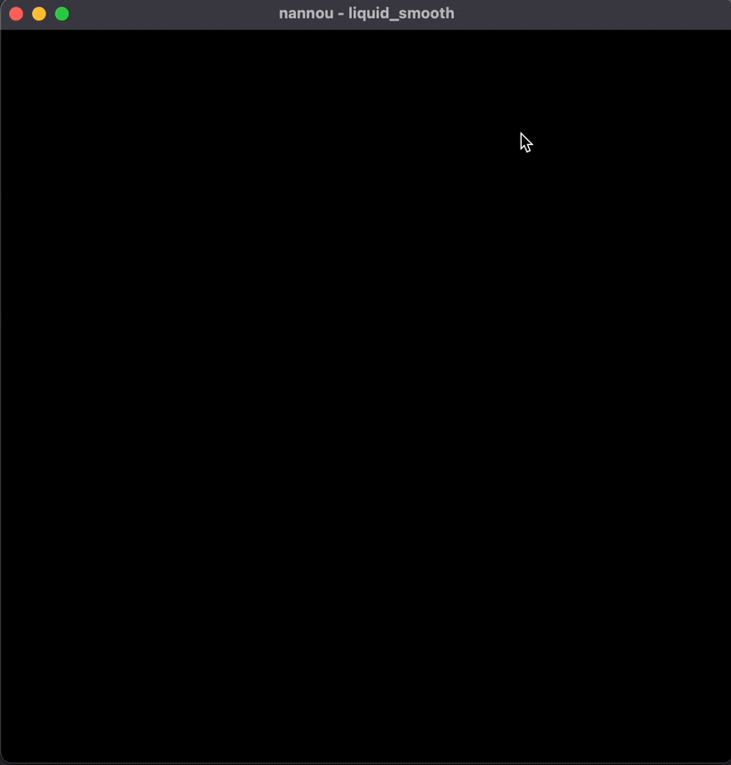

# Liquid Smooth

An example sketch using the Fluid crate.

Click and density ("dye") is added to the center of the canvas. The mouse position, relative to the center, influences the velocity field and therefore how the dye is spread.

